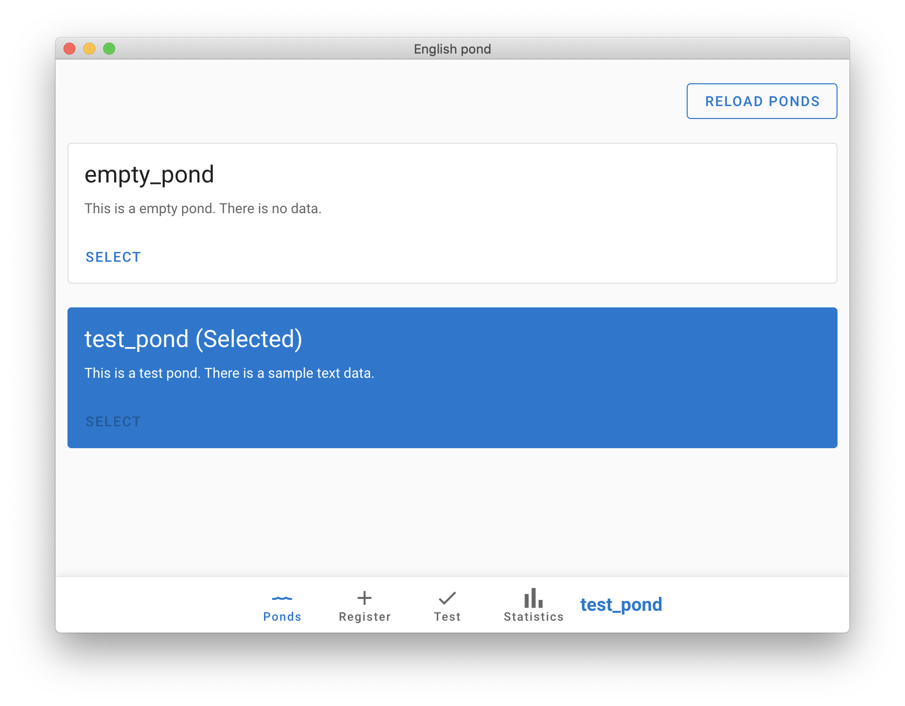
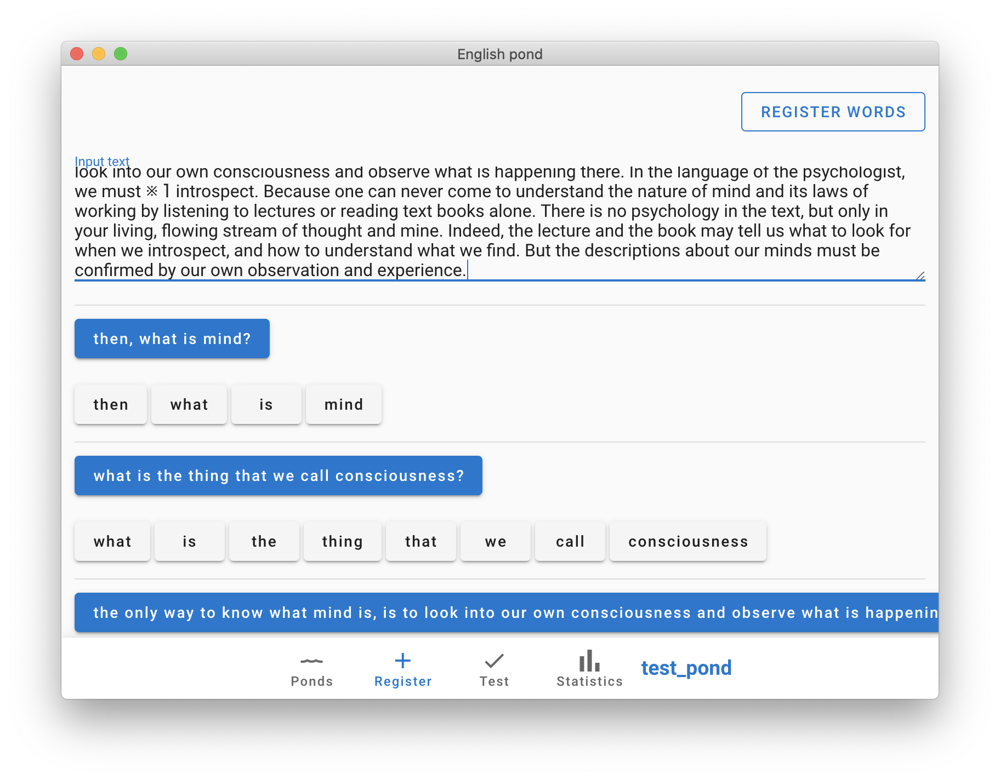
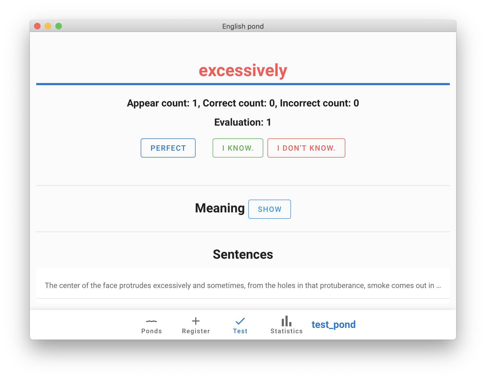
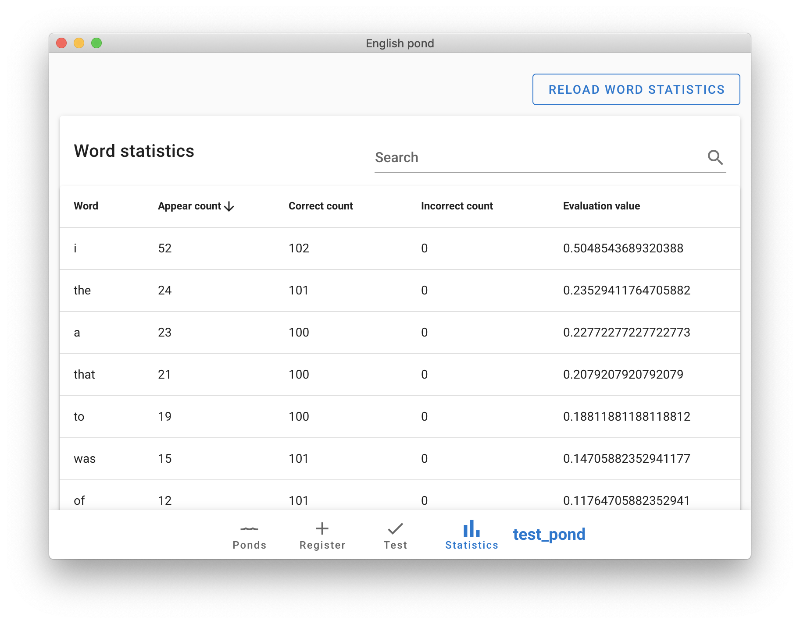

# English pond






## Description
This is a special wordbook(we call 'pond') for Japanese people. You can use this to learn English words efficiently.

Functions:
- Manage multiple wordbooks
- Register English text
- Break down English text into sentences and words automatically
- Test English words
- Check Japanese meanings of registered English words
- Take statistics of the registered English words

This application uses the statistics information to evaluate the words.

It analyzes appearance frequency and correct answer rate, personalize test.
A word that is high appearance frequency and incorrect answer rate is evaluated highly. It is important for you that the evaluation value is high.

You can take the test that sets problems of only word that the evaluation is high.

## Requirement
- Node.js / npm

## Project setup
```
npm install
```

### Compiles and hot-reloads for development
```
npm run electron:serve
```

### Compiles and minifies for production
```
npm run electron:build
```

### Lints and fixes files
```
npm run lint
```
